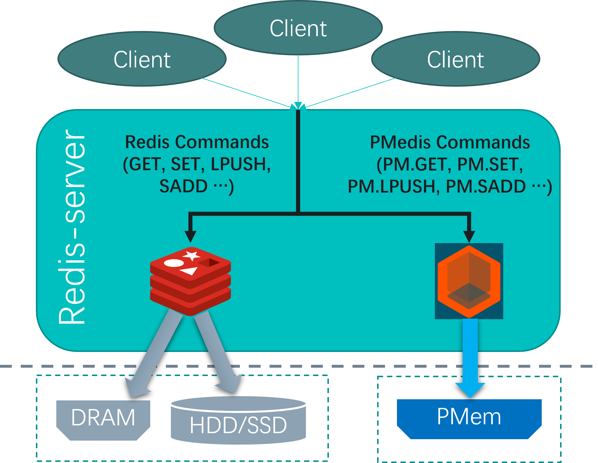
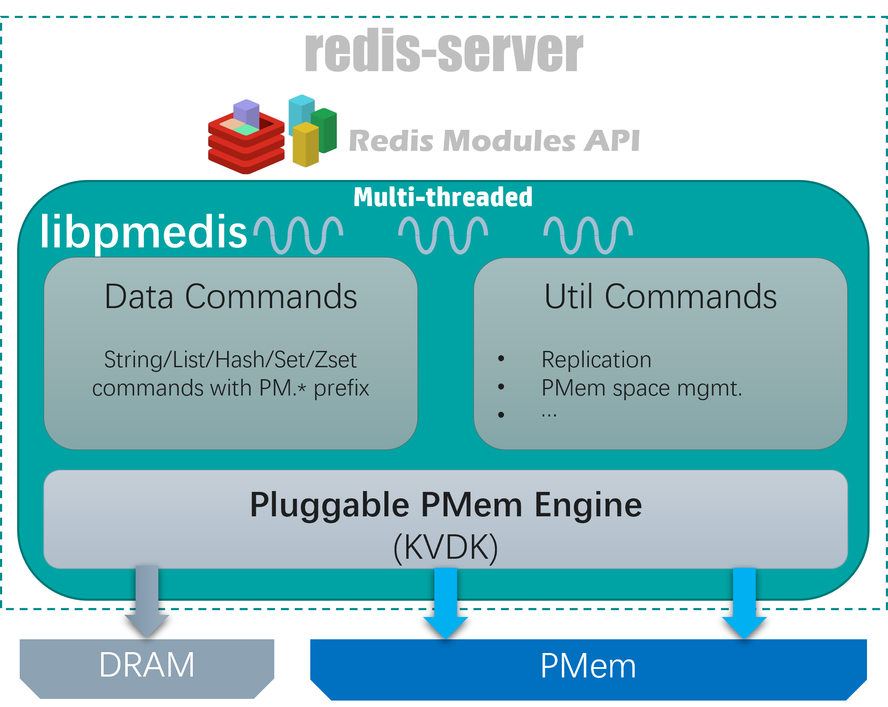

# PMedis
A Redis module to provide support for storing Redis native data structures on Persistent Memory (PMem).
===
## 1. Introduction
Persisting data in Redis with high-level data security is expensive and time-consuming. The intuitive method for persisting every operation by turning on AOF with ``appendfsync_always`` option. However, this approach results in significant performance degradation and almost impossible to use in real-world applications.

**PMedis** is specifically designed to tackle the pain point of persistent Redis by utilizing the latest persistent memory, *Intel Optane Persistent Memory Module (PMem)*.

### 1.1 Overview


As shown above, **PMedis** can be dynamically side-loaded with vanilla Redis as a module. Almost all commands of the five native Redis data structures are supported. User can use them to read/write the corresponding data in PMem by simply add a prefix **"PM."** to the commands and send to the redis-server.

### 1.2 Internal


Internally, **PMedis** adopts Intel's KVDK (Key-Value Development Kit) as the PMem engine to read/write data from/to PMem. With the help of Redis Module API, we can no longer limited by the single-thread prcessing model of vanilla Redis. More investigation of utilizing multi-threaded model upon KVDK to maximize the overall performance of PMedis is still on-going. We will release it as soon as it's ready.

Current supported commands include those of Redis native data structures (String, List, Hash, Set, ZSet), there will be more to be added in the future. In addition to that, **PMedis** also implements some the unique commands to facilitate the data management and cluster management. Details of all supported commands can be found in [Command List](./doc/cmdlist.md).

### 1.3 Cluster


Currently, **PMedis** rely on vanilla Redis to handle the multi-instance scenario and cluster mode. However, leader-follower synchronization is also one of the most expensive and important pain point of persistent Redis due to the data consistency issue. Therefore, **PMedis** is designed to use RDMA-capable NIC to achieve a high-performance leader-follower sync method which will be released in a later time this year. Moreover, we are also investigating the latest tools, Remote Persistent Memory Access Library(RPMA) from Intel, to achieve the best leader-follower synchronization method out of both PMem and RDMA.

## 2. Get Started

### 2.1 Build the .so library file of the module
Make sure all the building tools are properly installed in your own linux system. You can refer to the [dockerfile](./test/pmedis.dockerfile) for the full list of required building tools.
```bash
git clone <repo>
git submodule update --init --recursive
bash build.sh
```
Once successfully built, go to ``./test`` folder to check the two .so library (``libpmedis.so`` and ``libengine.so``) needed to start pmedis. Copy them to one of the path in the ``LD_LIBRARY_PATH`` or add the ``./test`` folder to ``LD_LIBRARY_PATH`` to make sure they can be found by redis-server in the next step.

### 2.2 Start Redis Server with a redis.conf file
Locate your own vanilla redis-server on the machine and follow the steps below to start the redis server with pmedis loaded as a redis module.
```bash
cd test
${REDIS_BIN}/redis-server pmedis.conf
```
```
# pmedis.conf has one line to load the pmedis module with default parameters as follows
loadmodule libpmedis.so pmem_path /pmem/pmedis max_write_threads 8 pmem_file_size  "8 << 30" populate_pmem_space 1 pmem_block_size 64 pmem_segment_blocks "2 << 20" hash_bucket_num "1 << 27" num_buckets_per_slot 1
```
Note that you need to modify ``pmem_path`` option to the actual pmem path in your system, the path should use pmem namespace in *App Direct Mode* with *fsdax* configuration and mounted in Ext4/XFS with DAX enabled. Please refer to [Intel's official guide](https://docs.pmem.io/persistent-memory/getting-started-guide) to prepare the PMem device.

Another module option ``pmem_file_size`` is used to configure the maximum PMem space to use for PMedis (*8GB* by default as shown above).

Check the redis log file (``redis-server.log`` by default).
```
80960:M 31 May 2022 14:31:07.970 * Module 'pmedis' loaded from ./libpmedis.so
80960:M 31 May 2022 14:31:07.971 * Ready to accept connections
```
Information above indicates PMedis is successfully loaded in the redis-server and you can connect to it with a ``redis-cli`` to have a try.

### 2.3 Connect to PMedis with ``redis-cli`` and try those commands
```
$ redis-cli -p 56379
127.0.0.1:56379> PM.SET pmedis success
OK
127.0.0.1:56379> PM.GET pmedis
"success"
127.0.0.1:56379> PM.RPUSH pmlist "one" "two" "three"
(integer) 3
127.0.0.1:56379> PM.LPOP pmlist
"one"
127.0.0.1:56379> PM.LPOP pmlist
"two"
127.0.0.1:56379> PM.LLEN pmlist
(integer) 1
127.0.0.1:56379> PM.HSET pmhash aaa 111
(integer) 1
127.0.0.1:56379> PM.HSET pmhash bbb 222
(integer) 1
127.0.0.1:56379> PM.HGETALL pmhash
1) "bbb"
2) "222"
3) "aaa"
4) "111"
127.0.0.1:56379> PM.HKEYS pmhash
1) "bbb"
2) "aaa"
127.0.0.1:56379> PM.HINCRBY pmhash aaa 1
(integer) 112
...
```

### 2.4 Alternative method: Docker
We also prepared [``pmedis.dockerfile``](./test/pmedis.dockerfile) for you to try PMedis in a more convenient way.

Go to ``test/`` folder, and follow the steps below
```
$ docker build --ssh default -t pmedis_example:dev -f pmedis.dockerfile .
...
Successfully tagged pmedis_example:dev
```
``pmedis_example:dev`` is the image name and you can replace it with any name you want. Once the docker image is successfully built, you can start to use PMedis like this:
```
$ docker run -it --rm --name pmedis_example -p 56379:56379 -v <local_pmem_path>:/pmem pmedis_example:dev
```
Note that, you need to replace ``<local_pmem_path>`` with the one you prepared in 2.2. If it's the first time you run and everything goes well, you can see output like below and start to use.
```
Starting pmedis-server in docker ...
No PMedis data found, start initialization and wait for 100 secs
Have fun :)
127.0.0.1:56379> pm.set pmedis success
OK
127.0.0.1:56379> pm.get pmedis
"success"
127.0.0.1:56379> pm.rpush pmlist a b c
(integer) 3
127.0.0.1:56379> pm.lpop pmlist
"a"
127.0.0.1:56379> shutdown
(0.65s)
not connected> exit
```
Note that when you want to exit, you need to use ``shutdown`` **explicitly** to stop the server and exit the container. After that, you'll be able to use the same docker command to reconnect the server without losing data.
```
$ docker run -it --rm --name pmedis_example -p 56379:56379 -v <local_pmem_path>:/pmem pmedis_example:dev
Starting pmedis-server in docker ...
PMedis data exists, start recovery and wait for 15 secs
Have fun :)
127.0.0.1:56379> pm.get pmedis
"success"
127.0.0.1:56379> pm.lpop pmlist
"b"
127.0.0.1:56379> shutdown
(0.71s)
not connected> exit
```

## 3. Roadmap


## 4. Community

PMedis is developed by MemArk (https://memark.io/en), which is a tech community focusing on leveraging modern storage architecture for system enhancement. MemArk is led by 4Paradigm (https://www.4paradigm.com/) and other sponsors (such as Intel). Please join our community for:

Chatting: For any feedback, suggestions, issues, and anything about using PMedis or other storage related topics, we strongly encourage you to join our interactive discussion channel at Slack #pmedis-help

Development discussion: If you would like to formally report a bug or suggestion, please use the GitHub Issues; if you would like to propose a new feature for some discussion, or would like to start a pull request, please use the GitHub Discussions, and our developers will respond promptly.